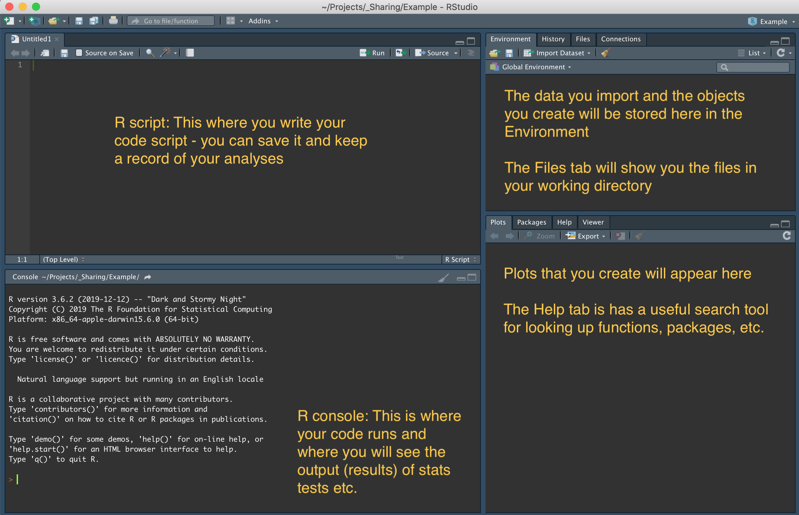
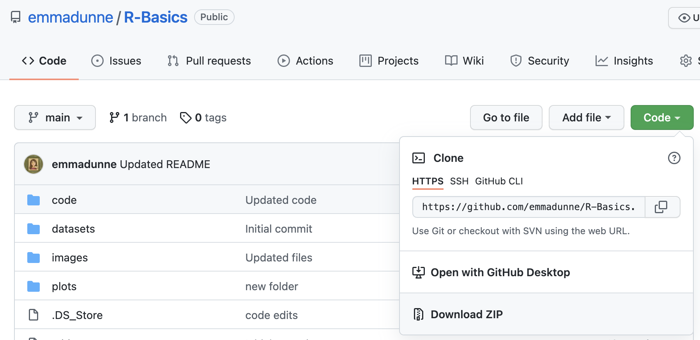
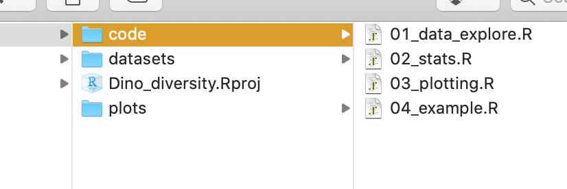

# R Basics


This tutorial will provide a step-by-step guide to get you familiar with using R and RStudio for running analyses and creating plots. The instructions and code are set up so that you can work through this in your own time, but if you are tuning in to the live session, make sure you have completed **Part 1** below before we begin.

The possibilities with R are endless, as is the time we could spend exploring the programme. But here, we're going to work through an example that will hopefully help you hit the ground running, and everything else will start making sense as you go along.


**Objectives of this tutorial:**

* Install and set up R and RStudio
* Import and explore some data
* Perform some simple statistical analyses
* Create some cool plots


*** 

## Part 1: Installation and setup


#### 1.1 Install R and RStudio


To get started you will need the following software installed on your computer: [R](https://www.r-project.org) and [RStudio](https://www.rstudio.com), a helpful editor and tool that keeps everything neat:

* [Download and install R](https://cloud.r-project.org)

* [Download and install RStudio Desktop](https://www.rstudio.com/products/RStudio/#Desktop)

There is so much info out there online and in books for using R, but if you're just getting started, I would recommend these simple guides:

* [YaRrr! The Pirates's Guide to R](https://bookdown.org/ndphillips/YaRrr/where-did-this-book-come-from.html)
* [An Introduction to R and RStudio cheatsheet - Miles Benton](http://sirselim.github.io/Introduction-to-R-and-RStudio/cheatsheet/index.html)
* [R for cats](https://rforcats.net/)


Once you have RStudio installed and opened, take a look around! 




You can change the arrangement of these panes as well as pick a colourful theme for RStudio:

1. Select _Tools > Global Options.._
2. Navigate to the _Appearance_ tab
3. Choose an editor theme from the dropdown menu
4. Click _Apply_ then _OK_


#### 1.2. Set up a new R Project

In RStudio, you can [create 'projects'](https://support.rstudio.com/hc/en-us/articles/200526207-Using-Projects) to help keep everything neat and tidy. This is especially useful if you are working on more than one research project at a time (and perhaps want to use version control), but is still generally good practice for keeping your files, code, etc. organised.

To set up a new RStudio project (.Rproj):

1. Select _File > New Project..._
2. Create a project from a _New Directory_ (following this, select _New Project_ if promopted)
3. Give the directory a name and place it in a convenient place (Desktop is fine for now!)
4. Click _Create project_  - this creates a new project file (.Rproj) within a project directory (i.e. a folder)


To keep everything organised, we'll create some sub-folders within the project directory (folder) you've just created above: one for datasets, one for script files (code) and another for the plots we create.

At the top of this page, you'll see a green button that says _Code_. Click on this and then choose _Download ZIP_, which will download a ZIP folder of all the files:



Once downloaded, navigate to the ZIP folder and copy both the _datasets_ folder (containing a .csv file) and the _code_ folder (containing four scipt files), and paste these directly into the project directly you created above. 
Finally, you'll need to create a empty _plots_ folder. Your project directly should now look similar to this:





#### 1.3. Installing packages

R packages are a collection of functions, typically used for a specific purpose, such as phylogenetic analysis, advanced modelling, etc. In this tutorial we're going to mostly use functions from _base R_ (i.e. R without any additional packages), but sometimes we will use coding syntax from a package called _tidyverse_ and will use the graphics package _ggplot2_ to create our plots (which is conveniently included in the _tidyverse_ package). We'll also use some other packages that contain useful functions for making great plots.


To install a R package, you can either use the menu bar or code the functions directly into the console.

To **install** a package using the RStudio menu bar:

1. Select _Tools > Install packages.._
2. Search for the package by name (e.g. _tidyverse_) and select it from the drop-down menu that appears
3. Click _Install_ (at which point some text might scroll through in the console pane)

To **install** a package using the R console, type the following directly at the *>* :
```{r}
install.packages("tidyverse")
```


The other packages you'll need to install before the live tutorial are:

* `colourpicker`
* `RColorBrewer`
* `viridis`
* `cowplot`


*** 

## Part 2: Import data files, some stats, and plotting

#### 2.1 Open R script & import data

For this next part, you'll need to open the script file _01_data_explore.R_ in RStudio. There, we'll follow the steps to import our data file, explore the data and organise the file how we want it for analyses.


**TIP:** Lines that begin with # are comments. If you run any code that starts with #, R will just ignore that line. Comment on your code script LIBERALLY - I promise you will forget what you were trying to do if you don't take note of it!


Example code (and comments) for importing data:
```{r}
# Import the pokemon dataset
pokemon <- read.csv("./datasets/pokemon.csv", header = TRUE, stringsAsFactors = FALSE)

# Take a peak at the dataset
head(pokemon)
```

#### 2.2 Explore the data

Using the same script from above, we'll use various base-R and `tidyverse` functions to take a look at the structure and content of our dataset

**TIP:** A handy place to find lots of useful data manipulation functions is in the cheatsheet: In the menu bar, select _Help > Cheatsheets > Data Transformation with dplyr_


#### 2.3 Stats!

Next, we'll check out how to do some simple stats. For this, you'll need the script file _02_stats.R_.


